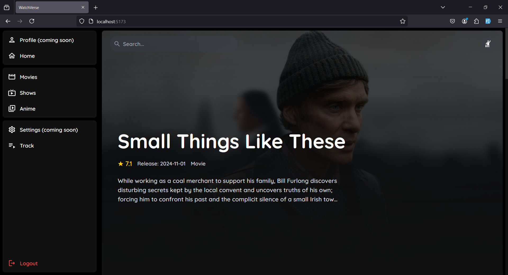
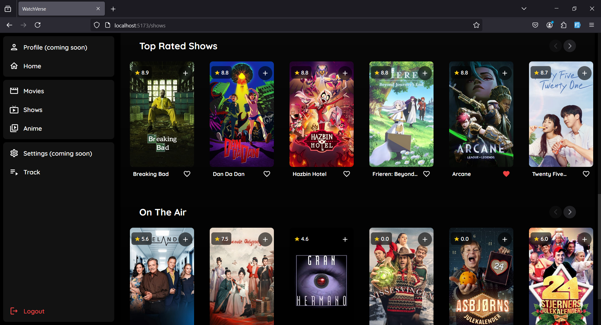
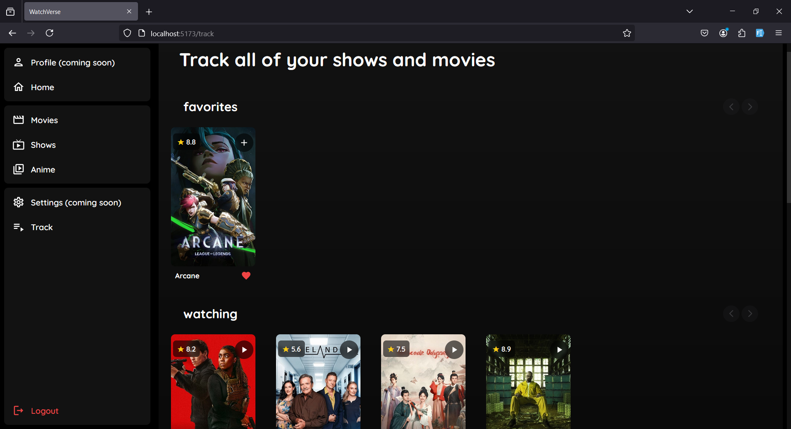

# WatchVerse 🎬

WatchVerse is a modern web application for tracking and discovering movies, TV shows, and anime. Built with React and powered by TMDB API, it offers a seamless experience for managing your watchlist and discovering new content.

<div align="center" style="color: red;">
  please note that the backend is not implemented in this repository, so you have to implement it yourself.
  <br />
  <br />
</div>

## Showcase ✨

**Home**

<div align="center">
  
</div>

**Shows**

<div align="center">
  
</div>

**Track**

<div align="center">
  
</div>

## Features ✨

- **Content Discovery**

  - Browse trending movies, TV shows, and anime
  - Search across multiple content types
  - View top-rated and popular content
  - Real-time content updates

- **User Features**

  - Personal watchlist management
  - Favorite content tracking
  - Custom status tracking (Watching, Watched, Plan to Watch)
  - User authentication system

- **UI/UX**
  - Responsive design
  - Dynamic content loading
  - Smooth animations
  - Modern dark theme interface
  - Intuitive navigation

## Tech Stack 🛠

- **Frontend**

  - React 18
  - Tailwind CSS
  - React Router DOM
  - Axios
  - React Icons

- **API Integration**
  - TMDB API
  - Custom Backend API

## Getting Started 🚀

1. **Clone the repository**
   ```bash
   git clone https://github.com/harryarrouida/watchverse-front.git
   cd watchverse-front
   npm install
   npm run dev
   ```
